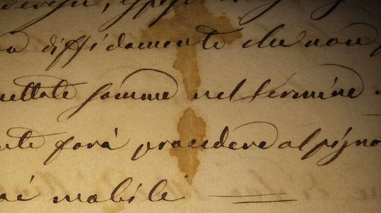

<figure>

<figcaption>Photo by <a href="https://unsplash.com/@fioreale">Alessio
Fiorentino,window=_blank</a> on <a
href="https://unsplash.com/photos/MiNq1Mjikfw">Unsplash,window=_blank</a></figcaption>
</figure>

# Introduction

Handwriting Recogniser implements [DJL,window=\_blank](http://djl.ai) to
train a neural network on images of handwritten numbers within the range
of 0-9. It can then generate the probabilities of an input image
matching each of these numbers.

# Get started

See one or more of the following ways to get started, depending on
preference of learning approach:

-   Perform the [???](#intro-component::install-and-run-quickstart.adoc)
    to run Handwriting Recogniser.

-   Complete the [???](#tutorial/handwriting-recogniser-tutorial.adoc)
    to gain practical experience of the API.

-   Read the [???](#handwriting-recogniser-deep-dive.adoc) to gain a
    deeper theoretical understanding of the chatbot.

-   See the [???](#intro-component::api-spec.adoc) for fine details of
    the API.
