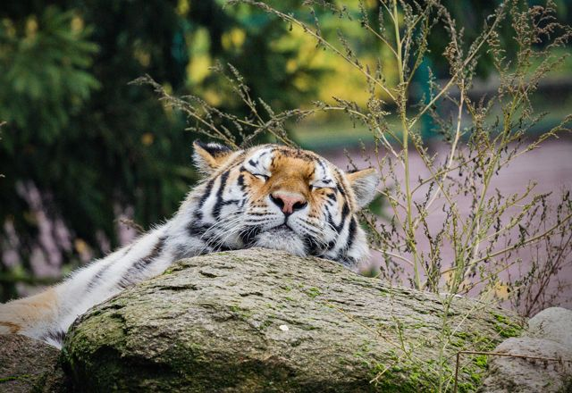

# Zoo Chatbot
{: .no_toc }

## Table of contents
{: .no_toc .text-delta }

1. TOC
{:toc}

<figure>

<figcaption>Photo by <a href="https://unsplash.com/@kovah">Kevin
Woblick,window=_blank</a> on <a
href="https://unsplash.com/photos/_54TF64ad9M">Unsplash,window=_blank</a></figcaption>
</figure>

# Introduction

Zoo Chatbot implements
[OpenNLP,window=\_blank](https://opennlp.apache.org) to train a set of
question patterns about a zoo and match them to one of five answers. It
can then generate the probabilities of each answer being correct.

# Get started

See one or more of the following ways to get started, depending on
preference of learning approach:

-   Perform the [???](#intro-component::install-and-run-quickstart.adoc)
    to run Zoo Chatbot.

-   Complete the [???](#tutorial/chat-tutorial.adoc) to gain practical
    experience of the API.

-   Read the [???](#zoo-chatbot-deep-dive.adoc) to gain a deeper
    theoretical understanding.

-   See the [???](#intro-component::api-spec.adoc) for fine details of
    the API.
